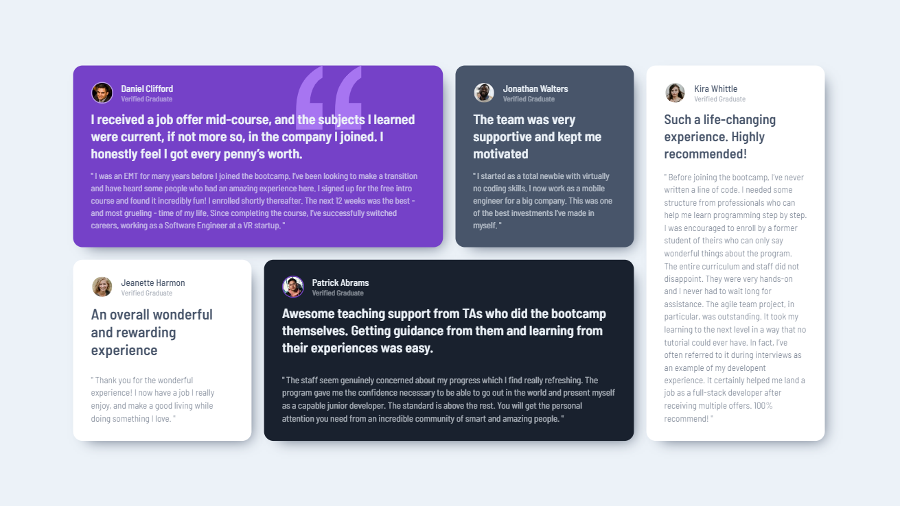

# Frontend Mentor - Testimonials grid section solution

Hi there!

Thank you for taking your time to review my project. This is a solution to the [Testimonials grid section challenge on Frontend Mentor](https://www.frontendmentor.io/challenges/testimonials-grid-section-Nnw6J7Un7). Frontend Mentor challenges help you improve your coding skills by building realistic projects. 

## Table of contents

- [The challenge](#the-challenge)
- [Screenshots](#screenshots)
- [Built with](#built-with)

### The challenge

This testimonials section is based on a grid layout. While the data is being fetched from Firebase, the user will see a loading spinner (to make this feature more prominent, the fetching function is embedded inside a setTimeout() function - I would not do it if it was a professional project). If the data is successfully loaded, the user will be able to see different animations and layout depending on their device's screen size. If the data fails to be loaded, the users will receive a simple error message.

### Screenshots

Mobile view:

Desktop view:

### Built with

- Semantic code
- SCSS
- TypeScript
- React.js
- Firebase
- Grid Layout
- Mobile-first workflow